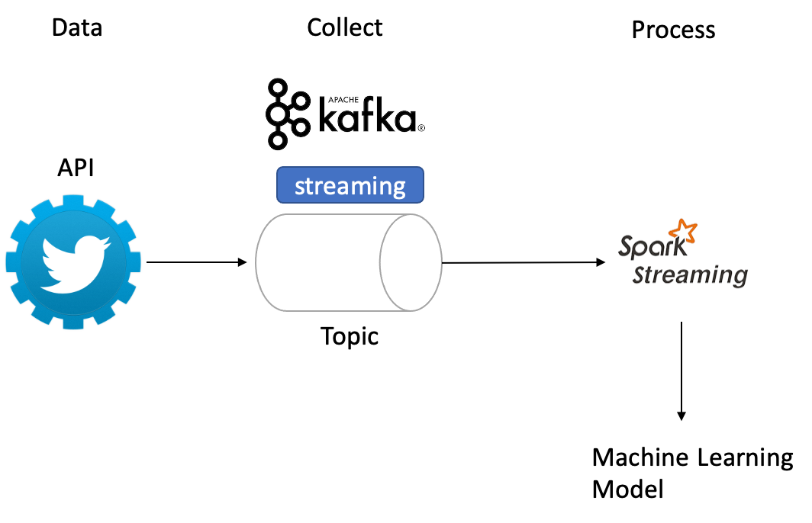
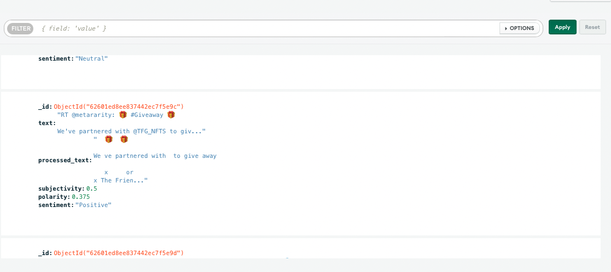

# Sentiment analysis on streaming Twitter data using Kafka, Spark Structured Streaming & Python

This project is a good starting point for those who have little or no experience with Kafka & Apache Spark Streaming.

Input data: Live tweets with a keyword
Main model: Data preprocessing and apply sentiment analysis on the tweets
Output: Text with all the tweets and their sentiment analysis scores (polarity and subjectivity)

I use Python version 3.10.8, Spark version 3.2.3 and Scala 12.

I also add jar to spark/jars:
- mongodb-driver-sync-4.8.2.jar
- bson-4.8.2.jar
- commons-pool2-2.11.1.jar
- mongodb-driver-core-4.8.2.jar
- mongo-spark-connector_2.12-10.1.0.jar
- spark-streaming-kafka-0-10-assembly_2.12-3.2.3.jar
- kafka-clients-3.2.3
- spark-sql-kafka-0-10_2.12-3.2.3

## Part 1: Ingest Data using Kafka 

This part is about sending tweets from Twitter API. ta using Kafka. I use Kafka on Confluent Cloud.

## Part 2: Tweet preprocessing and sentiment analysis
In this part, we receive tweets from Kafka and preprocess them with the pyspark library which is python's API for spark. We then apply sentiment analysis using textblob; A python's library for processing textual Data.

After sentiment analysis, we write the sentiment analysis scores and store it in MongoDB.
## Part 3: Output

## How to run the project
1. Create a Twitter developer account and get your API keys
2. Create a MongoDB Atlas account and get your connection string
3. Create a Confluent Cloud account and get your API keys
4. Clone the project
5. Create a virtual environment (Conda) and install the requirements
6. Run the project - Kafka producer "python kafka/producer.py getting_started.init"
7. Enjoy!
